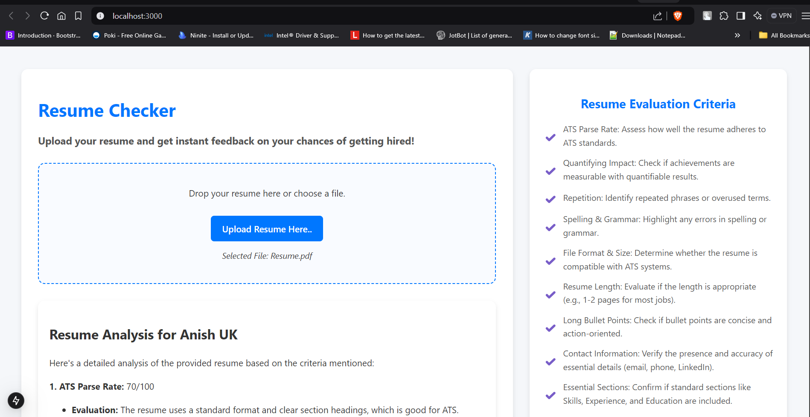

# 📄 Resume Checker

This project is a **Resume Checker** that allows users to upload their resumes and get instant feedback on their chances of getting hired. It uses Next.js for the frontend and backend, and integrates with the Google Generative AI API to analyze the resumes.



## ✨ Features

- 📄 Upload resume in PDF format
- 🔍 Get feedback on various criteria such as ATS Parse Rate, Quantifying Impact, Repetition, Spelling & Grammar, and more
- ⚡ Real-time processing and feedback display
- 🎨 Clean and user-friendly UI

## 🛠️ Installation

1. **Clone the repository**:
    ```sh
    git clone <your-repo-url>
    cd <your-repo-name>
    ```

2. **Install the dependencies**:
    ```sh
    npm install
    ```

3. **Create a `.env` file** in the root directory and add your Google Generative AI API key:
    ```env
    GOOGLE_GENERATIVE_AI_API_KEY=your_api_key
    ```

4. **Run the development server**:
    ```sh
    npm run dev
    ```

    The app will be available at `http://localhost:3000`.

## 📦 Dependencies

Here are the main dependencies used in this project:

- `next`
- `react`
- `formidable`
- `dotenv`
- `fs`
- `path`

You can find the complete list of dependencies in the `package.json` file.

## 🚀 Running the Application

1. **Start the development server**:
    ```sh
    npm run dev
    ```

2. **Open your browser** and navigate to `http://localhost:3000`.

## 📸 Usage

### **Upload Resume**:
- Click the "Upload Resume Here.." button or drag and drop your file.
- The app will process your resume and display feedback based on the specified criteria.

### **Feedback Criteria**:
The app evaluates the resume based on the following criteria:
1. **ATS Parse Rate**: Assess how well the document adheres to ATS standards.
2. **Quantifying Impact**: Check if achievements or key points are measurable with quantifiable results.
3. **Repetition**: Identify repeated phrases or overused terms.
4. **Spelling & Grammar**: Highlight any errors in spelling or grammar.
5. **File Format & Size**: Determine whether the document is compatible with ATS systems.
6. **Document Length**: Evaluate if the length is appropriate (e.g., a concise document for most professional applications).
7. **Long Bullet Points**: Check if bullet points are concise and action-oriented.
8. **Contact Information**: Verify the presence and accuracy of essential details (email, phone, LinkedIn, etc.).
9. **Essential Sections**: Confirm if the document includes critical sections (such as Skills, Experience, and Education).
10. **Hard Skills**: Evaluate the relevance of technical proficiencies or hard skills listed.
11. **Soft Skills**: Assess the clarity and relevance of soft skills included.
12. **Active Voice**: Check if bullet points use active voice rather than passive voice.
13. **Buzzwords & Clichés**: Identify overused buzzwords or vague terms and suggest improvements.
14. **Design**: Review the document design for readability and ATS compatibility.

## 🌐 API Endpoints

### **POST** `/api/server`
- **Description**: Handles file upload and processes the resume using the Google Generative AI API.
- **Request Body**: `multipart/form-data` containing the resume file.
- **Response**: JSON object with a message containing detailed feedback about the resume.

### Example Request

```http
POST /api/server
Content-Type: multipart/form-data

{
  "resume": "<your-file.pdf>"
}
```
 
 
### ❤️ HAPPY CODING ❤️